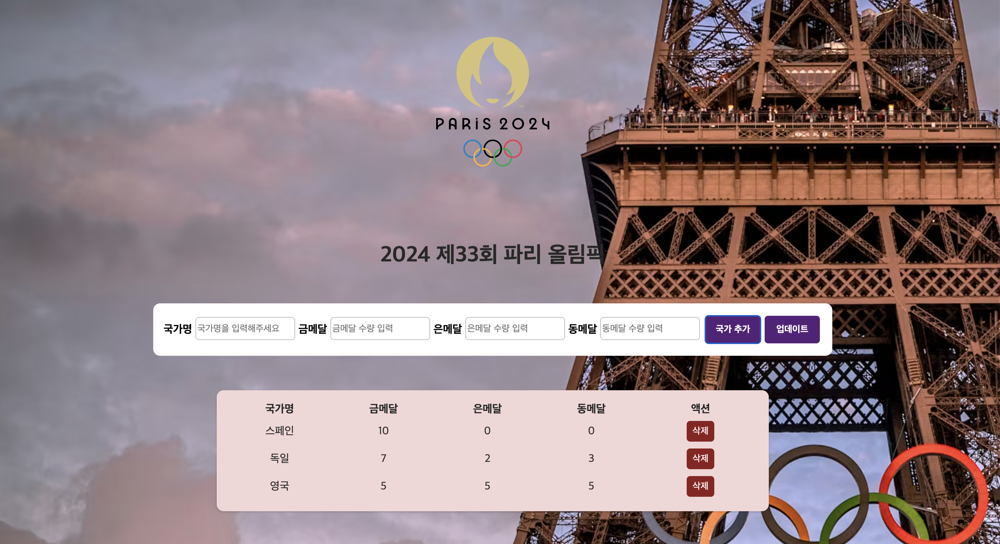

# 📁 올림픽 메달 트래커

## 🌑 구현 기능

- 제출(입력) 폼 구현: 국가명, 🥇🥈🥉 메달 수를 입력할 수 있는 폼
  메달 집계 CRUD 구현하기

- Create: 새로운 나라와 그 나라가 획득한 메달 수 추가 기능

- Read: 추가한 나라별 메달 집계 리스트 보여주기

- Update: 기존에 추가된 나라의 메달 수를 수정하여 리렌더링 하기

- Delete: 선택한 국가 정보를 리스트에서 삭제하기

 

## ✔️ 추가 기능

- 유효성 검사

1. 중복 국가 처리
2. 존재하지 않는 국가 알림

- 정렬 기능

1. 금메달 기준으로 내림차순 정렬
2. form 하나로 버튼제어 : form onsubmit에서 "국가추가", "업데이트" 버튼이 동작할 때 타겟 이름에 따라 실행

 

### 깃헙 커밋 규칙

| 작업 타입   | 작업내용                       |
| ----------- | ------------------------------ |
| ✨ update   | 해당 파일에 새로운 기능이 생김 |
| 🎉 add      | 없던 파일을 생성함, 초기 세팅  |
| ♻️ refactor | 코드 리팩토링                  |
| 🩹 fix      | 코드 수정                      |
| 🚚 move     | 파일 옮김/정리                 |
| 🔥 del      | 기능/파일을 삭제               |
| 💄 style    | css                            |
| 🌱 readme   | readme                         |

 

### 🚀 트러블 슈팅

[CRUD] [이름이 중복되는 값 거르기? some vs find](https://izzie-note.tistory.com/111)

[객체복사 & ... 사용] [{...data, gold: 변경값, silver: 변경값}](https://izzie-note.tistory.com/113)

[정렬기능] [추가할때는 적용되는데, 값을 업데이트 했을때는 또 어떻게 적용하지?](https://izzie-note.tistory.com/115)

[form 이벤트위임] [나의 react에서는 왜 e.target.name이 안되는가?..](https://izzie-note.tistory.com/116)
